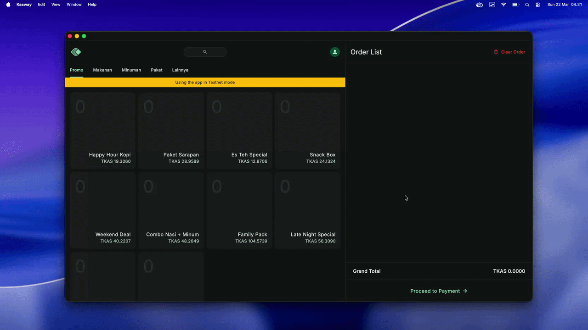

# Kasway — Kaspa Point of Sale

A Flutter-based point-of-sale terminal that accepts **Kaspa (KAS)** payments via QR code. Built for merchants who want to accept crypto at the counter without a payment processor or third-party custodian.

> **Trademark notice:** "Kasway" is a trademark of the project author. See [License](#license) for terms.

---

## Features

- **Kaspa QR payments** — generates a `kaspa:` URI with amount and encrypted order payload; auto-detects payment via wRPC polling
- **Multi-currency display** — 26 display currencies (KAS, IDR, USD, EUR, and 22 more); live rates via CoinGecko, no API key required
- **Product catalog** — SQLite-backed catalog with categories, additions/variants, and optional fixed KAS price override
- **Order history** — full line-item history with KAS rate snapshot per order
- **Table layout** — drag-and-drop floor plan editor; served/occupied/free states per table
- **Withdrawal tracking** — record outgoing KAS withdrawals with fiat equivalent snapshot
- **External display** — mirror the payment QR to a second screen (Android/iOS)
- **Auto-donation** — opt-in per-transaction KAS donation to the developer (percentage or fixed amount)
- **Multilingual** — English, Indonesian, Malay, Chinese (Simplified), Japanese, Korean
- **macOS, Android, iOS** targets; Windows and Linux builds compile but are untested

## Screenshots



## Tech Stack

| Layer | Technology |
|-------|-----------|
| UI | Flutter 3, Material 3 |
| State management | `flutter_bloc` (BLoC + Cubit) |
| Navigation | `go_router` |
| Local storage | SQLite via `sqflite`, `shared_preferences` |
| Crypto wallet | Pure Dart — `bip39`, `bip32`, BIP340 Schnorr signing |
| Node connectivity | `dart:io WebSocket` → Kaspa public wRPC nodes |
| Localization | Flutter ARB / `flutter_localizations` |

## Prerequisites

- [Flutter SDK](https://docs.flutter.dev/get-started/install) ≥ 3.22 (`flutter --version`)
- Dart ≥ 3.4 (bundled with Flutter)
- For macOS builds: Xcode command-line tools
- For Android builds: Android SDK / Android Studio

```bash
flutter doctor   # verify your setup
```

## Getting Started

```bash
# 1. Clone
git clone https://github.com/furatamasensei/pos.git
cd pos

# 2. Install dependencies
flutter pub get

# 3. Run (choose a target)
flutter run -d macos
flutter run -d android
flutter run -d ios
```

### Code generation

Models use `freezed` + `json_serializable`. If you change any model, regenerate:

```bash
dart run build_runner build --delete-conflicting-outputs
```

Localization is generated automatically by the Flutter tooling. To regenerate manually:

```bash
flutter gen-l10n
```

## Architecture

```
lib/
├── app/           # App-level setup: router, theme, cubits (currency, wallet,
│                  #   network, locale, table, donation, display)
├── data/          # Freezed models, SQLite repositories, services
│                  #   (KaspaWalletService, DataService, PayloadCodec)
└── features/      # Feature modules — each has bloc/ and view/
    ├── auth/      # Onboarding, seed phrase, EULA, login
    ├── home/      # POS screen, cart, Kaspa payment QR, table selection
    ├── items/     # Product & category management
    ├── profile/   # Settings, orders, withdrawals, network, donations, display
    └── splash/    # App-load gate (waits for wallet + rates)
```

All product prices are stored in **IDR**. The currency layer converts at display time using KAS as a bridge currency. Prices are never stored in KAS to avoid precision drift.

## Running Tests

```bash
flutter test                         # all tests
flutter test --coverage              # with coverage report
flutter test test/features/home/     # specific directory
```

## Contributing

Contributions are welcome. Please read [CONTRIBUTING.md](CONTRIBUTING.md) before opening a pull request.

## Code of Conduct

This project follows the [Contributor Covenant](CODE_OF_CONDUCT.md). By participating you agree to abide by its terms.

## License

Licensed under the **Apache License 2.0** — see [LICENSE](LICENSE) for the full text.

**Trademark:** The name "Kasway" and any associated logos are trademarks of the project author and are **not** covered by the Apache 2.0 license. You may not use the Kasway name or branding to identify your product or service. Forks and derivative works must be released under a different name.
